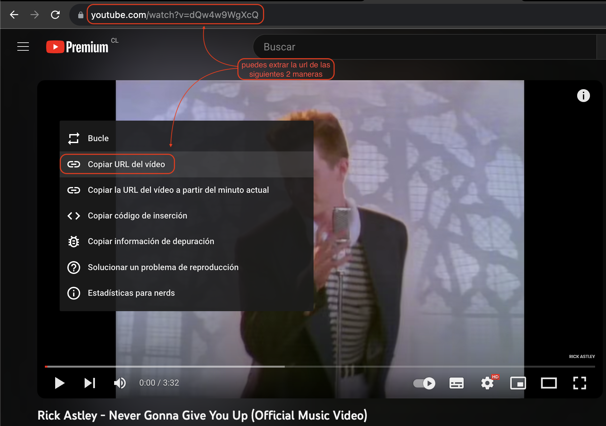
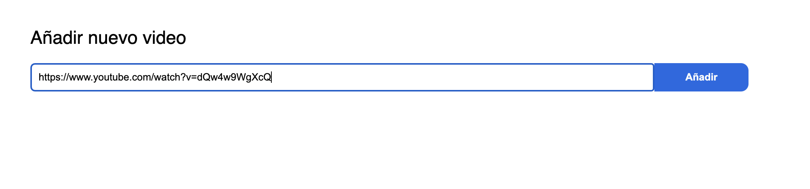
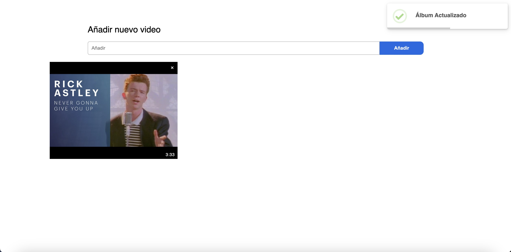
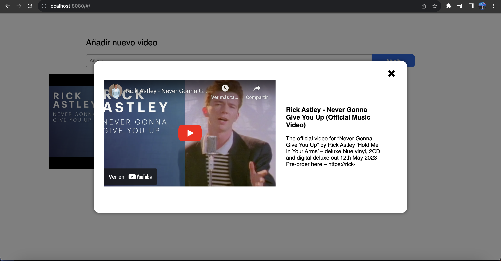
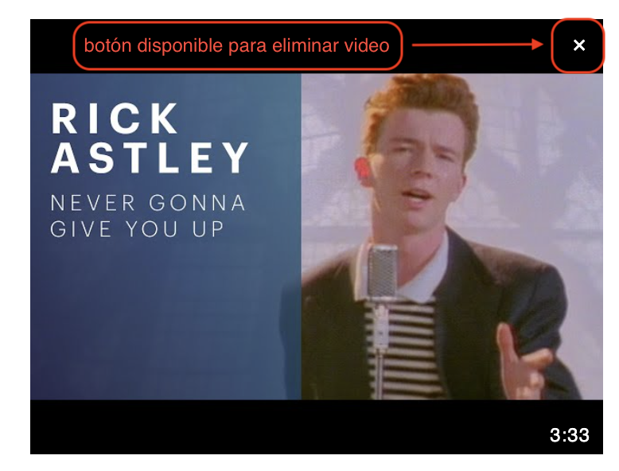
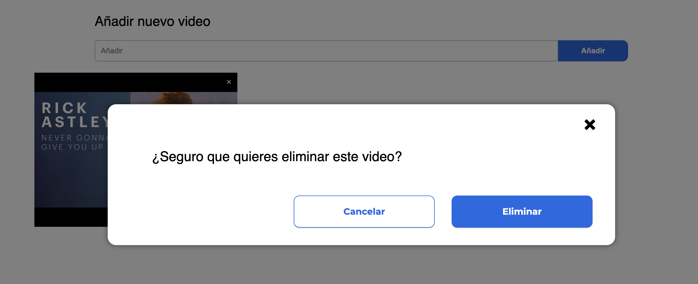
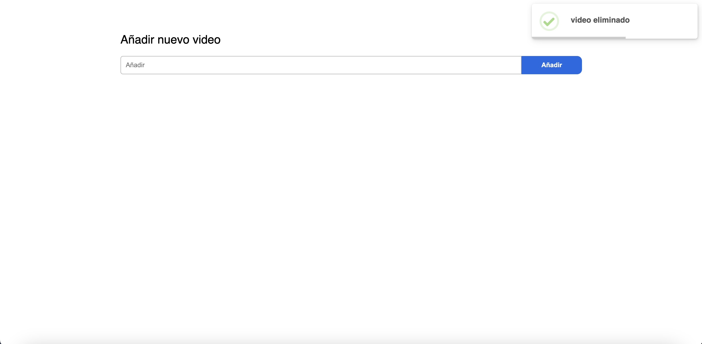

# album-videos

### instalar dependencias
```
npm install
```

### compilación y recargas en vivo para desarrollo
```
npm run serve
```

### compilación y minificación del proyecto para producción 
```
npm run build
```

### analisis de código y correccion de archivos
```
npm run lint
```

### Configuración Personalizada
Vea [referencias de configuración](https://cli.vuejs.org/config/).


# Configuración Para El Uso

para usar la aplicacion he creado un backend en node.js, acá me estoy conectando a una base de datos que he creado localmente, utilizando mysql

#### clonar repositorio

Para usar la aplicación, primero debes clonar el repositorio desde GitHub:

```bash
git clone https://github.com/Gabugueado/backend-album-video.git
```

### configurar Base de datos

Una vez clonado, sigue estos pasos para configurar la aplicación:

1. Cambia la configuración de la base de datos

En el proyecto, estamos utilizando una base de datos MySQL localmente. Debes ajustar las configuraciones de la base de datos según tus necesidades. En el archivo index.js, encontrarás la configuración de conexión a la base de datos. En este ejemplo, se utiliza la siguiente configuración:


```javascript
export const connection = mysql.createConnection({
    host: 'localhost',
    database: 'album_videos',
    user: 'root',
    password: 'Abcd1234!',
    charset: 'utf8mb4',
    multipleStatements: true,

});
```
nota: lo estoy exportando porque se usa en el archivo archivo api.js
Asegúrate de cambiar los valores de host, database, user, password, y cualquier otro parámetro necesario para que coincidan con tu entorno de desarrollo.

### Instala las dependencias

Para instalar las dependencias del proyecto, ve al directorio del proyecto y ejecuta el siguiente comando:

```bash
npm install
```
### Inicia el backend

Una vez que hayas configurado la base de datos y instalado las dependencias, puedes iniciar el servidor backend. Ejecuta el siguiente comando:

```bash
npm run dev
```

Ahora, el backend de la aplicación estará en funcionamiento y listo para ser utilizado.

# Uso de la aplicación

Extraiga la URL del video que desea agregar al álbum de videos.



En el campo disponible, debe pegar la URL para poder agregar el video al álbum.




Una vez haga clic en "Añadir", se le informará que el álbum ha sido actualizado y aparecerá el video.




Para poder ver el video, haga clic en la imagen y se desplegará una ventana emergente (modal).



Para eliminar el video, haga clic en el icono "X".



Al hacerlo, aparecerá una ventana emergente donde se le preguntará si está seguro de que desea eliminar el video.



Si está seguro de eliminar el video, haga clic en "eliminar". Una vez hecho, el modal desaparecerá y el video será eliminado. Además, se le informará mediante una alerta que el video ha sido eliminado.

